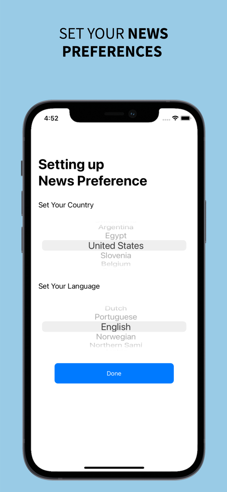
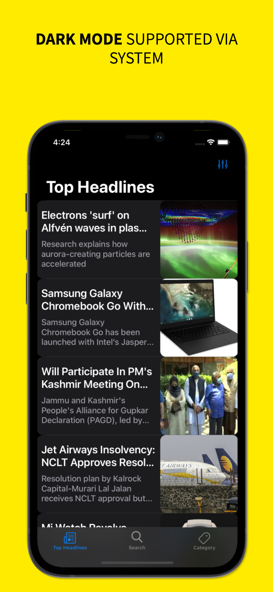

# NewsNest

The NewsNest app utilizes NewsAPI and shows users the Top Headlines of country, Technology News, Sports News, and many others. Users can also search News via Topic like Apple, Users can set their country and language, and News will be shown accordingly.

## App Features

1. Get Current Top Headlines (Country Specific).
2. Search any News on Topic you like.
3. Direct you to News acticle where its published.
4. Set Country and Language you disire for News and it will store in the app as persistent data
5. Get Category vise News Like Sports, Tech, Business
6. Adapts to dark or light mode based on the system.

## Screenshots
  &nbsp; &nbsp;  &nbsp; &nbsp;  &nbsp; &nbsp;   &nbsp; &nbsp;  &nbsp; &nbsp;  
## How to build/compile
1. Open "NewsNest.xcodeproj" file.
2. Select appropriate simulator.
3. Click the run button or command + R to run the project.

## Requirements
1. Xcode 12
2. Swift 5
3. iOS 13

## API used 

1. https://www.NewsAPI.org/

## License
This code is free and open source.
